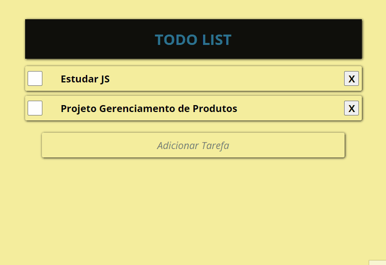

<main>

<h1>ToDo List</h1>

 
 
 

 

 
 <h2>Sumário</h2>
 <ul>
   <li><a href="#proj">Projeto</a> 
    <li><a href="#desc">Descrição</a> 
   <li><a href="#func">Funcionalidades</a> 
   <li><a href="#base">Database</a> 
 </ul> 

<h2 id="proj">Projeto</h2>

 

    <h2 id="desc">Descrição</h2>
    
Este é um projeto onde posso fazer o gerenciamento de minhas tarefas. O objetivo dele é praticar e melhorar minhas habilidades em javascript 

<h2 id="func">Funcionalidades</h2>
<ul>
    <li>Adicionar Tarefas
    <li>Remover Tarefas
    <li>Checklist de tarefa concluída
    
</ul>

<h2 id="base">Database</h2>

Este projeto utiliza LocalStorage para fazer a persistência de dados

 

</main>
